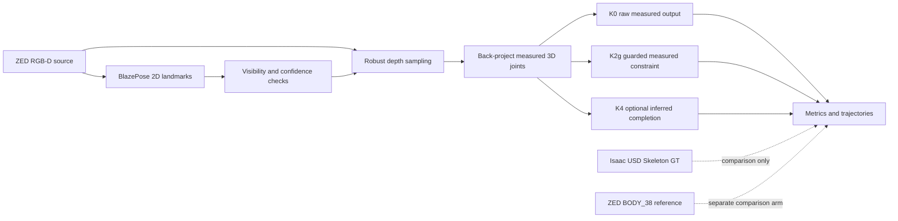
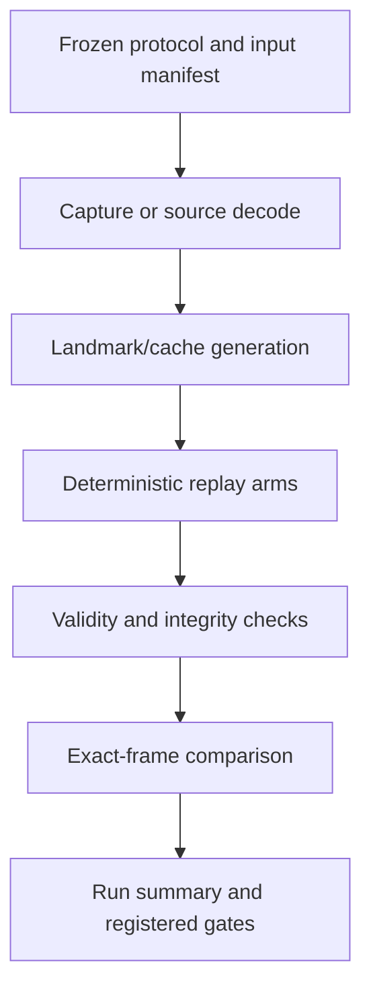

# Architecture and data contracts

## System boundary

The baseline combines BlazePose 2D landmarks with ZED RGB-D depth. It estimates
3D joint positions, limb lengths, and optional kinematic outputs for HRC
research. ZED SDK `BODY_38` is a reference/comparison pipeline and is kept
outside the baseline path.



## Coordinate and unit convention

Project outputs use the frozen ZED camera-coordinate convention:

- `+X`: forward from the camera
- `+Y`: camera-left
- `+Z`: upward
- distance: metres

For pixel location `(u, v)`, metric depth `d`, and intrinsics
`(fx, fy, cx, cy)`, back-projection is:

```text
X = d
Y = -(u - cx) * d / fx
Z = -(v - cy) * d / fy
```

Limb length is the Euclidean distance between two 3D joints:

```text
L(a, b) = ||P_a - P_b||_2
```

Column names alone are not sufficient to infer axes. New exporters and
comparators must record coordinate system and units explicitly.

### Controlled-arm USD unit exception

The controlled-arm USD declares `metersPerUnit = 0.01`, but its geometry,
3.50 m placement, and ZED live chain use one scene unit as one operational
metre. Dynamic-GT derived data therefore applies the frozen correction:

```text
operational_value_m = captured_declared_usd_m / metersPerUnit
                    = captured_declared_usd_m * 100
```

Raw captures remain unchanged. Unit-corrected artifacts live in a separate
derived location and carry a protocol/hash audit. Applying metadata-based
scaling again would introduce a 100x error.

## Landmark and evaluation contracts

`configs/joint_mapping.csv` maps Isaac, ZED, and BlazePose definitions to 15
canonical joints. The core full-body position metric uses 13 of them. Points
with materially different semantics, such as neck or nose, are not added to
the core metric without a declared contract change.

BlazePose landmarks usually lie on a visible body surface. Isaac USD Skeleton
GT is a skeleton pivot. Their raw positional difference therefore combines
estimation error with a semantic surface-to-pivot offset.

Dynamic right-arm experiments use only:

```text
right elbow + right wrist
```

The metric is named
`right_arm_two_joint_mean_position_error_mm`; it must not be presented as
full-body MPJPE.

## Depth sampling

Depth is sampled only after landmark validity checks. The frozen default
depends on the acquisition regime:

- Clean offline static simulation: `median_7x7`.
- Offline dynamic-GT studies: the method frozen in each replay, normally
  paired with BlazePose Lite and ROI 0.65.
- Real ZED live: `wrist_aware_v5`, designed to recover wrist-depth holes that
  a fixed 7x7 window can miss.

`wrist_aware_v5` includes pixel- and time-dependent controls. Its live result
at 960x600/60 FPS does not imply the same behavior at 1920x1080/30 FPS or in
SVO replay.

## Kinematic output families

| Family | Meaning | Validity/provenance rule |
|---|---|---|
| K0 | Raw measured 3D joints | Reflects depth validity directly |
| K2g | Guarded eight-bone projection | Default constraint for valid measured joints; does not create missing measurements |
| K4 | Root-guarded right-arm completion | Optional inferred output; reported separately and never overwrites measured joints |

K2g rejects projection for a chain containing an out-of-domain bone. K4 is
intended for selected missing-depth cases, not unrestricted hallucination. A
complete 2D shoulder loss cannot be bridged merely by root-depth inference.

Every output row should preserve enough provenance to answer:

1. Was the joint directly measured or inferred?
2. Which sampler and kinematic family produced it?
3. Which input frame/timestamp and configuration were used?
4. Was the result generated before or after any frozen protocol?

Measured coverage and inferred coverage must be reported separately.

## Ground-truth and reference hierarchy

| Source | Role | Permitted claim |
|---|---|---|
| Isaac USD Skeleton, synchronized to the rendered frame | Simulation ground truth | Position error under the declared mapping and semantic limitations |
| ZED SDK `BODY_38` | Reference/comparison estimate | Agreement, availability, or paired error relative to independent GT |
| Real SVO replay without independent human GT | Sensor input, not GT | Coverage, continuity, agreement, and repeatability; not absolute accuracy |
| `mesh.obj` after failed held-out registration | Visualization-only environment mesh | Visual context only; no clearance/separation numbers |

The real SVO and OBJ cannot be assumed to share a capture or world coordinate
frame. Their attempted held-out registration failed; downstream geometric
clearance analysis is disabled.

## Capture, replay, and comparison layers



Capture and estimation are intentionally separated where possible. Paired
method arms replay the identical landmark/depth cache. Comparators join by the
frozen frame identity (for example time code plus timestamp) rather than by
row position or nearest unregistered time.

Historical pilots, aborted captures, and failed gates are retained. They are
not overwritten by later revisions; a later protocol receives a new version
and its own status.

## Live performance accounting

The formal live configuration uses a 960x600 ZED stream, requested/source
timestamp 60 FPS, `NEURAL_LIGHT` depth, depth stabilization 30, BlazePose Lite,
ROI 0.65, latest-frame acquisition, and a 150-frame warm-up for formal depth
A/B work.

Performance reports distinguish:

- requested/source timestamp FPS;
- source acquisition FPS;
- actual output or consumer FPS;
- consumer compute latency;
- queue latency; and
- host latency.

Offline algorithm throughput omits camera acquisition and transport. It is not
camera-to-output FPS. Likewise, a selector runtime or streaming-consumer FPS
does not by itself establish end-to-end real-time performance.

## Deployment boundaries

The architecture supports explicit failure and abstention. Continuous output
is not automatically preferable to missing output: inferred or fitted
skeletons can remain available while being wrong. Safety-related use would
require independent validation, uncertainty handling, fail-safe behavior, and
human-subject/generalization evidence beyond this repository's present scope.
