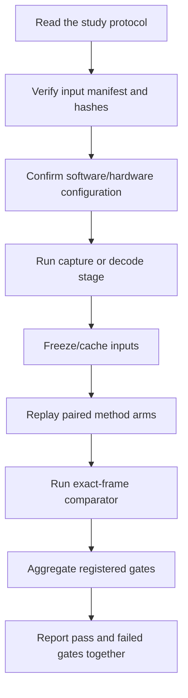

# Reproducibility guide

The project mixes dependency-light numerical tests, offline replay,
Isaac-specific capture, and physical ZED acquisition. Reproduction should be
planned by tier rather than treated as a single command.

## Reproduction tiers

| Tier | What can be checked | Typical requirements |
|---|---|---|
| 1. Unit and integrity tests | Sampling, constraints, schemas, protocol guards, mocked capture lifecycle | Python and test-specific packages such as NumPy |
| 2. Frozen offline replay | Paired method arms, comparators, aggregate gates | Frozen manifests/caches plus analysis dependencies |
| 3. Isaac simulation capture | RGB, metric depth, intrinsics, USD Skeleton GT | Compatible Isaac Sim scene/assets and renderer setup |
| 4. Real ZED capture/replay | Live acquisition, SVO decode, SDK depth/body reference paths | Compatible ZED camera where required, ZED SDK/`pyzed` 5.4.0 for the recorded studies, and relevant models |

A Tier 1 pass does not establish scientific replication. Hardware-free tests
validate software behavior and integrity rules, not sensor accuracy or study
validity.

## Minimal dependency-light checks

From the repository root:

```powershell
python -m pip install -r requirements/ci.txt
python -m compileall -q tools tests
python tests/portable_suite.py
python tests/research_components_suite.py
```

This explicit 23-module allowlist runs 213 tests and is the required hosted CI
scope. It was validated from a clean tree with no `output/` directory. The
private research workspace contains additional SDK, media, experiment-specific,
and frozen-lineage checks; do not describe this curated CI result as a pass of
that unreleased full workspace.

The 2026-10-05 update adds a separate supplemental research-component allowlist,
also run in CI. Its synthetic tests cover released geometry, schedule, occlusion
and selector logic; they do not require private experiment assets. See the
[public code update scope](public_code_update.md). Git text normalization does
not replace original frozen-file hash verification.

The supplemental allowlist ran 400 tests across 17 modules in the isolated
staged-tree check; together with the original suite, 613 tests passed. No private
capture, simulator or live-camera experiment was rerun as part of publication.
No single frozen dependency manifest covers every tier. Use the profiles in
[`requirements/`](../requirements/README.md), and record the actual
interpreter, package versions, SDK, GPU/driver, and simulator build for any new
run.

## Frozen-study workflow

The intended order is:



For a particular study, use the command and configuration documented in that
study's protocol or execution note. The repository contains multiple
generations of similarly named scripts; selecting the newest filename is not
a valid substitute for following a frozen protocol.

## Inputs, manifests, and hashes

Formal bundles typically include a protocol lock, input manifest, state file,
and analysis summary. Hashes serve different purposes:

- **File SHA-256** verifies the serialized bytes transferred or stored.
- **Canonical-content SHA-256** verifies the defined logical JSON content.
- A protocol-to-manifest binding verifies that an analysis used the intended
  frozen input set.

Before replay:

1. verify every required source file against its manifest;
2. verify that the protocol references the expected manifest content hash;
3. confirm that no input artifact was regenerated after seeing outcomes;
4. preserve partial, aborted, excluded, and failed runs under their original
   identifiers; and
5. write a new version rather than overwriting a frozen bundle.

An input hash match establishes identity, not scientific validity. Validity
gates and claim boundaries remain necessary.

## Pairing and frame identity

Paired method comparisons should replay the same frozen landmark/depth input.
Join frames using the identity named in the protocol, such as
`decode_order_index`, `image_timestamp_ns`, render time code, and capture/run
identifier. Do not join by CSV row number unless the schema explicitly makes
that row number part of the frozen identity.

For the original real SVO:

- the SDK reports 2,499 frames, while sequential decode yielded 2,498 valid
  analysis frames (`0..2497`);
- image timestamps, not `frame / 30`, define elapsed time;
- approximately doubled intervals occur at 755->756 and 2005->2006; derivative
  calculations must break at these gaps; and
- seek-then-grab timestamps were checked against sequential decode.

The same-subject `run04` asset has additional timestamp gaps; its frozen rule
is to segment temporal quantities where `dt > 1.5 * median_dt`.

## Coordinate, mapping, and unit checks

Every replay/comparator should verify:

- ZED camera axes: `+X` forward, `+Y` left, `+Z` up;
- position units: metres internally and clearly declared conversions for
  millimetre reports;
- camera intrinsics associated with the exact stream/run;
- `configs/joint_mapping.csv` version and the 15-joint/13-core contract; and
- whether an endpoint is full-body core MPJPE or the two-joint right-arm mean.

For controlled-arm dynamic GT, apply the frozen operational-unit correction
exactly once:

```text
operational_value_m = captured_declared_usd_m / 0.01
```

Do not edit the raw capture and do not automatically reapply USD metadata
scaling to already corrected artifacts.

## Ground-truth checks

Simulation accuracy comparisons require synchronized Isaac USD Skeleton GT,
RGB/depth, camera intrinsics, mapping, coordinate frame, and unit audit.
`BODY_38` is not GT.

Real SVO replay in this repository has no independent human-joint GT. It can
support coverage, continuity, agreement, repeatability, and failure analysis,
but not absolute human-joint accuracy.

The real OBJ must not be used for clearance. Its SVO registration failed the
held-out gate. Reproduction of the failed optimizer result does not convert it
into a valid geometric reference.

## Provenance and coverage checks

For each output joint, retain at least:

- run and frame identity;
- canonical joint name;
- source sampler/method family;
- validity and confidence/visibility state;
- `measured` versus `inferred` provenance;
- coordinate frame and units; and
- relevant configuration/protocol hash.

K2g operates on valid measured chains and does not manufacture measured
coverage. K4 inferred joints must remain in a separate provenance category,
and the measured-overwrite count must remain zero.

Report denominators explicitly. Detection rate, core measured coverage,
per-joint coverage, and measured-plus-inferred availability answer different
questions.

## Performance reproduction

A performance claim is reproducible only if its boundary is declared. Record:

- requested/source timestamp FPS;
- source acquisition FPS and acquisition policy;
- actual output/consumer FPS;
- inference, sampling, constraint, and selector component times;
- queue and host latency where available;
- warm-up length;
- resolution, depth mode, and depth stabilization; and
- CPU/GPU placement and worker topology.

Do not relabel offline replay throughput, selector runtime, or consumer-loop
FPS as camera-to-output FPS. The current always-on dual-view experiment failed
its paired-FPS gate even though the selector itself was fast.

## Reporting a replication

A useful replication note should include:

1. repository commit and clean/dirty working-tree state;
2. protocol and input-manifest hashes;
3. environment and hardware versions;
4. exact command(s) and configuration path(s);
5. input/output artifact hashes;
6. every registered gate, including failures;
7. deviations, aborted attempts, and excluded data; and
8. the same claim boundaries used in the original study.

Do not replace a negative contract with a positive secondary endpoint. A later
follow-up can add evidence, but the original frozen outcome remains part of
the record.

## Cross-character randomized-block terminal branch

The first canonical same-input replay remains an immutable engineering failure:
`FAIL_sealed_replay_preserved_no_rerun`. It must not be resumed, promoted, or
pooled with later work. The independently frozen `rpr_v1` destination completed
24/24 fresh workers and passed 12/12 binary-exact A/B checks before the frozen
v8 selector was called exactly once.

That selector returned zero qualifying pairs among 6,126,120 candidates and
sealed `FAIL_v8_selector_no_authorized_bank`. Reproduction therefore ends at
the selector gate: do not rerun the selector, widen thresholds, recover a
near-miss bank, or execute the unauthorized confirmatory, calibration, or
36-bundle formal stages. The auditable terminal record is
[`fs_cts5_common_bank_randomized_block_science_recovery_v3_terminal_results_cn.md`](fs_cts5_common_bank_randomized_block_science_recovery_v3_terminal_results_cn.md).
